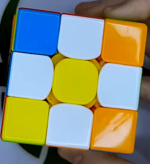
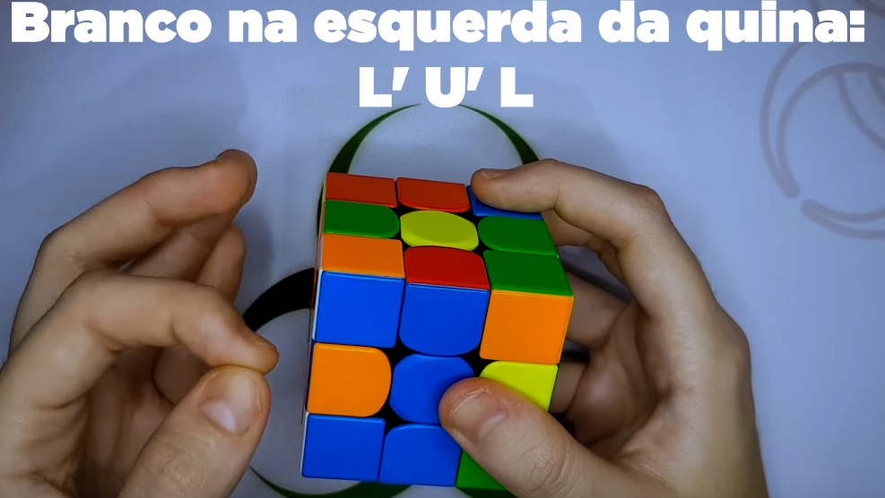

# Apostila 
Essa apostila é destinada as pessoas que querer aprender a resolver o cubo mágico.

Para resolver o cubo mágico é necessário seguir uma receita essa que pode ser dita um algoritmo, existe várias formas porém para os iniciantes, podem seguir os passos abaixo : 

### 1 - Cruz Branca 
 A primeira coisa a ser feita é uma cruz branca na parte de baixo do cubo, as peças do meio devem corresponder as cores das peças centrais ao fazer a cruz branca.

### 2 - Centro Amarelo e cruz branca 

### 3 - move a cruz branca para o centro branco

### 4 - coloque os cantos brancos alinhados com os centros 

### 5 - montar a segunda camada 
U R U' R' U' F' U F para lado direito 
U' L' U L U F U' F'

### 6 - cruz amarela
Na forma que estiver a cima o objetivo é colocar uma cruz amarela na face superior 
F R U R' U' F'
